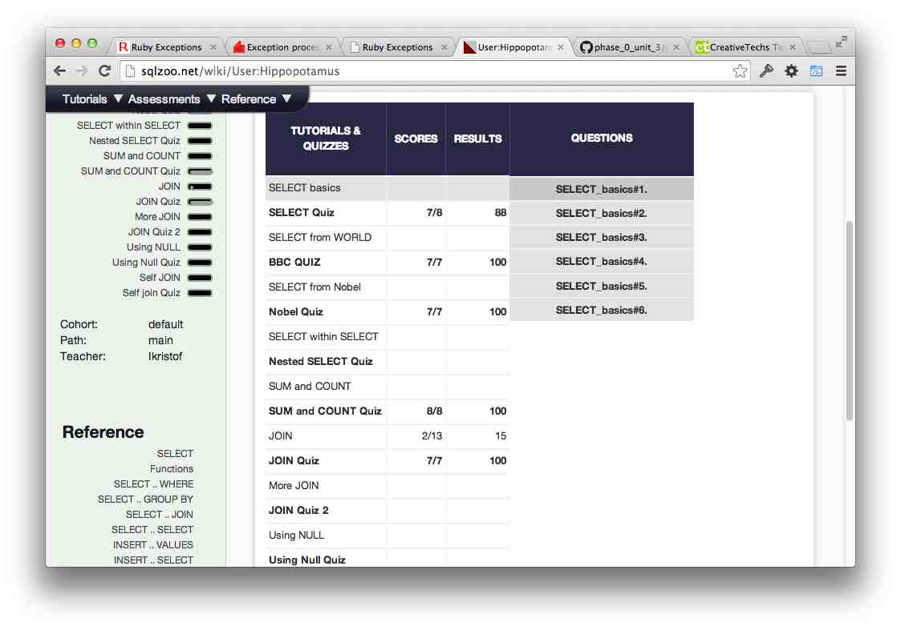

## U3.W7: SQLZoo

####I worked on this challenge [by myself].

### My Quiz Results:

### Reflection

The website was extremely frustrating. I have an 11" air, so I already don't have
the largest monitor. It was really frustrating trying to read the stuff on the site,
because it kept moving around and overlapping itself. I used [SQL course](http://www.sqlcourse.com)
to learn SQL, and then did the quizes on SQLzoo. I do have one question that I hope
that I remember to ask someone: what is the advantage of outer joins? They seem
way harder and messier to work with than inner joins.
