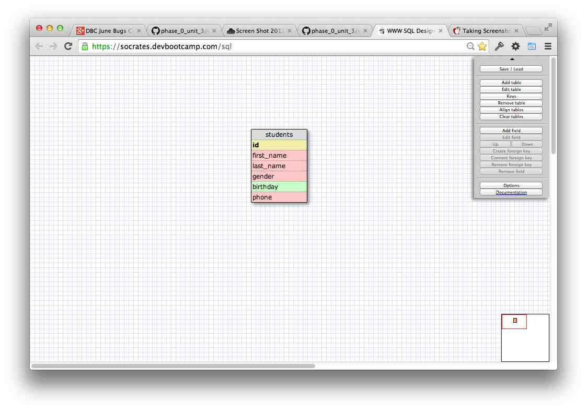
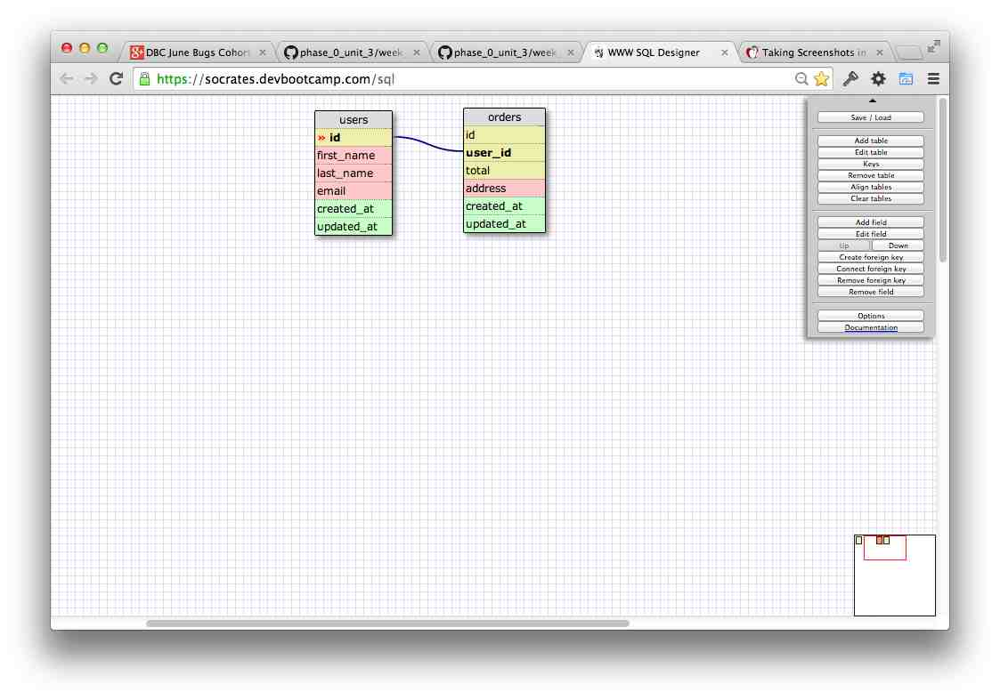
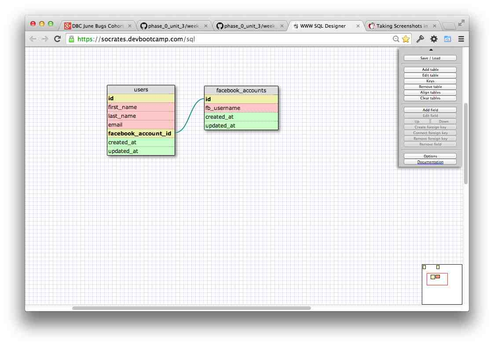
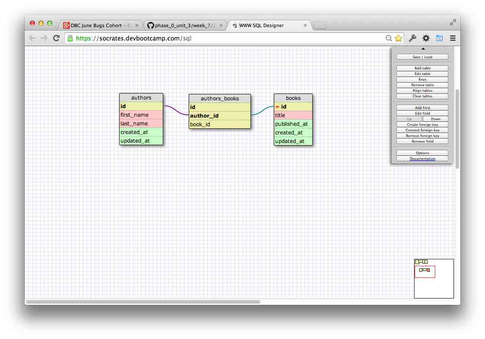
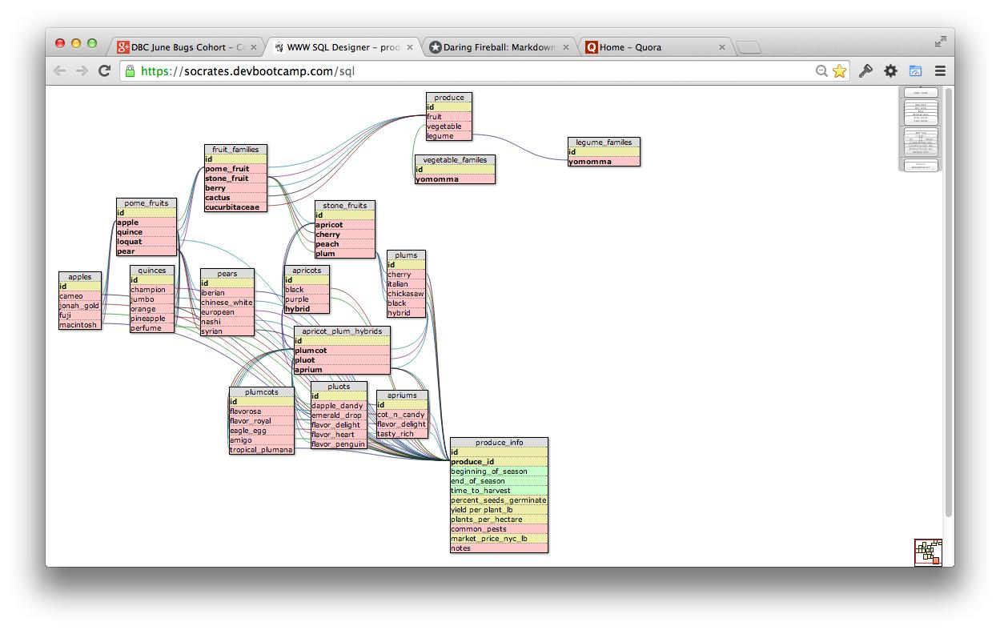

# U3.W7: Designing Schemas

#### I worked on this challenge [by myself]

## Release 0: Student Roster Schema

## Release 1: One to Many Schema

## Release 2: One to One Schema

## Release 3: Many to Many Schema

## Release 4: Design your own Schema
This is a model of different types of produce and their information. So, for example,
if I wanted to see all the brassicas, there would be a table of brassicas (yay, cabbage!).
At the bottom, which connects every type of produce is the information table. This
tells you the growing season, market price, pests, etc. There would be the option
with this to create a predator table, as well. So you could see how pests and their
predators correlate by what plants you grow. Example, one plant may attract a certain
type of spider which will protect other plants.  
I saved it as produce_adv

]

## Release 5: Reflection

It was cool to see a visual of the tables. I'm excited to see where this goes.
Databases are the reason I got into programming.
