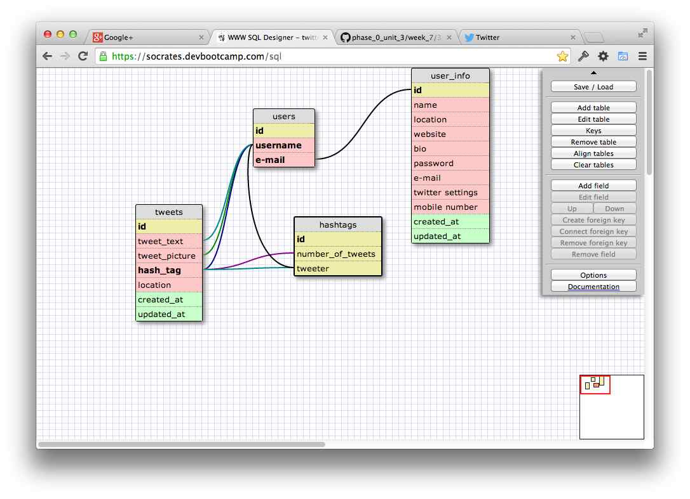

# U3.W7: Modeling a Real-World Database (SOLO CHALLENGE)

## Release 0: Users Fields
* name
* location
* website
* bio
* password
* e-mail
* twitter settings (how twitter interacts with you, notifications, etc...)
* mobile number

## Release 1: Tweet Fields
* tweet text
* picture
* location

## Release 2: Explain the relationship
The relationship between `users` and `tweets` is: one to many
<!-- because... --> one user can have many tweets

## Release 3: Schema Design

## Release 4: SQL Statements
<!-- Include your SQL Statements. How can you make markdown files show blocks of code? -->

    SELECT tweet_text FROM tweets  
    WHERE user = 'yomomma22';  

    SELECT tweet_text FROM tweets  
    WHERE user = 'yomomma22' AND created_at = "14 May, 2014";  

    SELECT tweet_text.tweets FROM tweets, users  
    WHERE user.tweets = username.users;  

    SELECT username.users FROM tweets, users  
    WHERE id.tweets = '1';  

## Release 5: Reflection
<!-- Be sure to add your reflection here!!! -->

It was interesting to do this assignment. I'm excited to look over other people's
answers and see how they approached the challenge.
